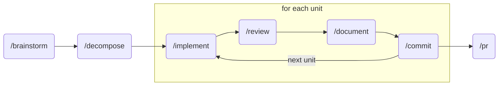

# claude-essentials

A [Claude Code](https://code.claude.com/) plugin with opinionated agents and skills for shipping code.

## Table of Contents

- [Background](#background)
- [Install](#install)
- [Usage](#usage)
- [Resources](#resources)
- [Maintainers](#maintainers)
- [Contributing](#contributing)
- [License](#license)

## Background

This plugin codifies how [JSA+Partners](https://jsapartners.co/) ships software with Claude Code. Every skill is human-gated. The workflow enforces a disciplined path from idea to pull request: brainstorm a user story, decompose it into single-commit units, then implement, review, document, and commit each unit before shipping the PR.

The review pipeline runs five specialized agents in parallel (complexity, architecture, technical, scope, and language idioms), then passes all findings through an adversarial skeptic agent to eliminate false positives.

## Install

```bash
/plugin marketplace add JSA-Partners/claude-essentials
/plugin install essentials@jsapartners
```

## Usage

The core workflow chains skills together. You review the output at every step and run `/clear` before moving on. This keeps the context window focused and puts a human in the loop at every stage.



### Core Loop

Start with `/decompose story.md` to break a story into unit files stored in `~/.cache/claude-essentials/`. Then work through each unit one at a time:

1. `/implement <unit-file>` to build it. Scan the changes, then `/clear`.
2. `/review <unit-file>` to run the review agents. Address findings, do a manual diff review, then `/clear`.
3. `/document <unit-file>` to capture any learnings. Review the docs, then `/clear`.
4. `/commit` to wrap up the unit.

Repeat for the next unit. When all units are done, run `/pr`.

Every command accepts a full unit file path. You can also pass a partial name like `auth` or `unit-02` and the skill will search `~/.cache/claude-essentials/` to find it. Commands work ad-hoc too: `/review src/` reviews a directory, `/document auth-patterns` documents a topic.

### Skills

| Skill | Purpose |
| ----- | ------- |
| `/brainstorm` | Brainstorm and create user stories through agent collaboration. |
| `/commit` | Generate conventional commit messages matching project patterns. |
| `/decompose` | Decompose a plan or user story into single-commit implementation units. |
| `/document` | Capture learnings from implementation into docs/claude, memories, or CLAUDE.md. |
| `/implement` | Implement one decomposed unit with idiomatic patterns and quality gates. Auto-detects Go or Svelte. |
| `/init` | Generate a CLAUDE.md for the current project based on codebase analysis. |
| `/meta` | Update the /sharpen skill with new resources. |
| `/playbook` | Inject behavioral plays and execution protocols. |
| `/pr` | Create a GitHub PR with conventional commit title. |
| `/review` | Review code with parallel specialized agents, adversarial verification, and human approval. |
| `/sharpen` | Systematically improve skills and agents using proven patterns. |

### Agents

| Agent | Purpose |
| ----- | ------- |
| `architecture-advisor` | Identifies superior design patterns. Conservative, only flags high-confidence issues. |
| `complexity-reviewer` | Reviews code for YAGNI, AHA, Rule of Three, SRP, DAMP, SOLID, DRY violations. |
| `go-idiom-reviewer` | Reviews Go code for idiomatic patterns, citing Effective Go. |
| `scope-reviewer` | Detects scope creep by tracing implementations to user stories. |
| `skeptic-reviewer` | Adversarial verification of other agents' findings. Eliminates false positives. |
| `story-drafter` | Converts feature ideas into implementable user stories with acceptance criteria. |
| `story-estimator` | Estimates story points using Fibonacci scale with codebase analysis. |
| `svelte-idiom-reviewer` | Reviews Svelte 5/SvelteKit code for idiomatic patterns. |
| `technical-reviewer` | Reviews code for security vulnerabilities, performance issues, data integrity risks. |

## Resources

- [Official Documentation](https://code.claude.com/docs) by Anthropic
- [Building Effective Agents](https://www.anthropic.com/engineering/building-effective-agents) by Anthropic
- [Claude Code Best Practices](https://www.anthropic.com/engineering/claude-code-best-practices) by Anthropic
- [How the Creator of Claude Code Uses It](https://x.com/bcherny/status/2007179832300581177) by Boris Cherny
- [Writing a Good CLAUDE.md](https://www.humanlayer.dev/blog/writing-a-good-claude-md) by Kyle Mistele
- [Claude Code 2.0 Guide](https://sankalp.bearblog.dev/my-experience-with-claude-code-20-and-how-to-get-better-at-using-coding-agents/) by Sankalp Shubham
- [Claude Code Tips](https://github.com/ykdojo/claude-code-tips) by YK Sugi

## Maintainers

[@mattjmoran](https://github.com/mattjmoran)

## Contributing

PRs accepted. For major changes, open an issue first.

## License

[MIT](LICENSE) © JSA+Partners
