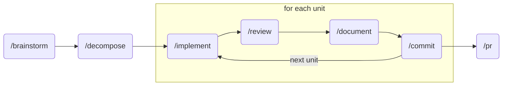

# dotclaude

[JSA+Partners'](https://jsapartners.co/) collection of [Claude Code](https://code.claude.com/) agents, commands, skills, and resources we use across our engineering projects.

## Getting Started

| Path                             | Description                                                                           |
| -------------------------------- | ------------------------------------------------------------------------------------- |
| [`agents/`](agents/)             | [Subagents](https://code.claude.com/docs/en/sub-agents) for specialized tasks         |
| [`commands/`](commands/)         | [Slash commands](https://code.claude.com/docs/en/slash-commands) for common workflows |
| [`skills/`](skills/)             | [Agent skills](https://code.claude.com/docs/en/skills) for domain-specific knowledge  |
| [`settings.json`](settings.json) | [Global settings](https://code.claude.com/docs/en/settings) and hooks configuration   |

### Install

Symlinks individual files into [`~/.claude/`](https://code.claude.com/docs/en/settings#available-scopes) so you can add your own agents, commands, and skills alongside. Re-run after `git pull` to pick up additions and clean up removals.

```bash
./install.sh
```

## Workflow

One story becomes one PR. `/brainstorm` drafts a user story, `/decompose` breaks it into single-commit units, then each unit loops through `/implement`, `/review`, `/document`, `/commit`. When all units are committed, `/pr` ships the story. Every step is human-gated.



## What's Included

### Agents

| Agent | Purpose |
| ----- | ------- |
| `architecture-advisor` | Identifies superior design patterns. Conservative, only flags high-confidence issues. |
| `complexity-reviewer` | Reviews code for YAGNI, AHA, Rule of Three, SRP, DAMP, SOLID, DRY violations. |
| `go-idiom-reviewer` | Reviews Go code for idiomatic patterns, citing Effective Go. |
| `openapi-generator` | Generates OpenAPI 3.1.1 spec sections from handler code. Supports Go, TypeScript, Python. |
| `scope-reviewer` | Detects scope creep by tracing implementations to user stories. |
| `skeptic-reviewer` | Adversarial verification of other agents' findings. Eliminates false positives. |
| `story-drafter` | Converts feature ideas into implementable user stories with acceptance criteria. |
| `story-estimator` | Estimates story points using Fibonacci scale with codebase analysis. |
| `svelte-idiom-reviewer` | Reviews Svelte 5/SvelteKit code for idiomatic patterns. |
| `technical-reviewer` | Reviews code for security vulnerabilities, performance issues, data integrity risks. |

### Commands

| Command | Purpose |
| ------- | ------- |
| `/brainstorm` | Brainstorm and create user stories through agent collaboration. |
| `/commit` | Generate conventional commit messages matching project patterns. |
| `/decompose` | Decompose a plan or user story into single-commit implementation units. |
| `/document` | Capture learnings from implementation into docs/claude, memories, or CLAUDE.md. |
| `/implement` | Implement one decomposed unit with idiomatic patterns and quality gates. Auto-detects Go or Svelte. |
| `/meta` | Update the /sharpen command with new resources. |
| `/openapi` | Generate or update OpenAPI 3.1.1 specification from codebase analysis. |
| `/playbook` | Inject behavioral plays and execution protocols. |
| `/pr` | Create a GitHub PR with conventional commit title. |
| `/review` | Review code with parallel specialized agents, adversarial verification, and human approval. |
| `/sharpen` | Systematically improve dotclaude commands, skills, and agents. |

### Skills

| Skill | Purpose |
| ----- | ------- |
| `bdd-comments` | BDD comment patterns and examples for test files. |
| `decompose` | Decomposition rules, research protocol, and evaluation checklist. |
| `implement` | Phased implementation workflow with idiom enforcement and quality gates. |
| `openapi` | OpenAPI 3.1.1 reference, language-specific patterns, and examples. |
| `review` | Parallel review orchestration with adversarial verification. |
| `sharpen` | Quality checklists and structural patterns for Claude Code artifacts. |
| `story-drafter` | Story templates, personas, and acceptance criteria patterns. |

## Resources

Guides that shaped how we work with Claude Code:

- [Official Documentation](https://code.claude.com/docs) by Anthropic
- [Building Effective Agents](https://www.anthropic.com/engineering/building-effective-agents) by Anthropic
- [Claude Code Best Practices](https://www.anthropic.com/engineering/claude-code-best-practices) by Anthropic
- [How the Creator of Claude Code Uses It](https://x.com/bcherny/status/2007179832300581177) by Boris Cherny
- [Writing a Good CLAUDE.md](https://www.humanlayer.dev/blog/writing-a-good-claude-md) by Kyle Mistele
- [Claude Code 2.0 Guide](https://sankalp.bearblog.dev/my-experience-with-claude-code-20-and-how-to-get-better-at-using-coding-agents/) by Sankalp Shubham
- [Claude Code Tips](https://github.com/ykdojo/claude-code-tips) by YK Sugi

## Plugins

Plugins enabled in [`settings.json`](settings.json):

- [Astral](https://github.com/astral-sh/claude-code-plugins) by Astral
- [Claude HUD](https://github.com/jarrodwatts/claude-hud) by Jarrod Watts
- [Code Review](https://github.com/anthropics/claude-plugins-official) by Anthropic
- [Gopls LSP](https://github.com/anthropics/claude-plugins-official) by Anthropic
- [Impeccable](https://github.com/pbakaus/impeccable) by Paul Bakaus
- [TypeScript LSP](https://github.com/anthropics/claude-plugins-official) by Anthropic

## License

Distributed under the MIT License. See [LICENSE](LICENSE) for more information.
